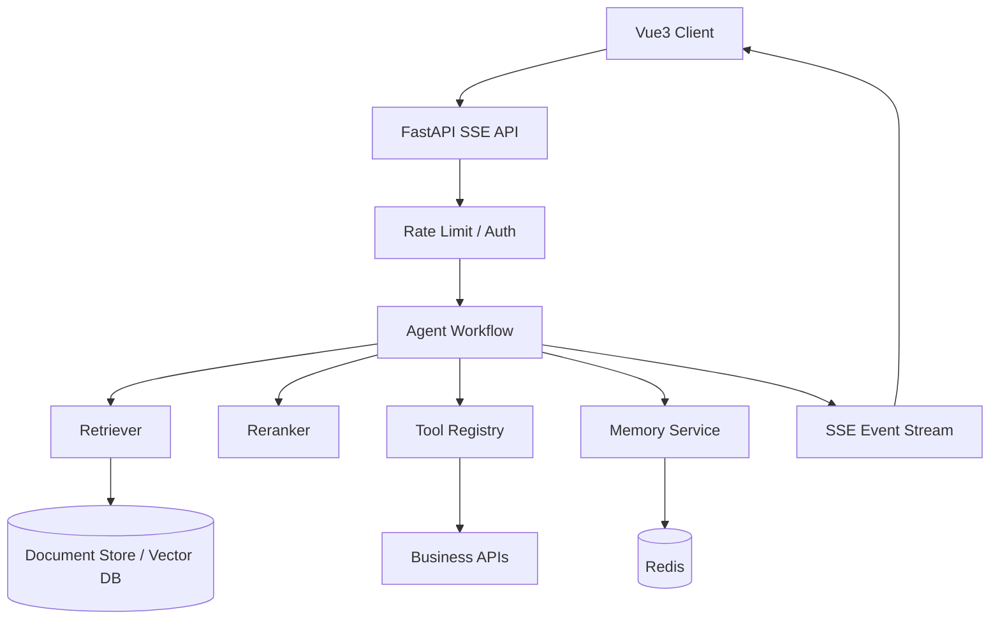
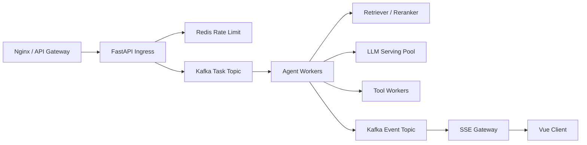

# Agentic-RAG-Platform

面向企业知识库、多轮问答和多工具任务的 Agentic RAG 平台骨架。项目重点不是做一个简单聊天界面，而是把大模型应用中的关键工程链路拆清楚：文档接入、切片检索、重排、会话记忆、SSE 流式输出、工具调用、状态管理和可观测性。

## 项目定位

传统 RAG demo 通常只覆盖“上传文档、检索片段、调用模型回答”。真实系统还需要处理更多工程问题：

- 文档清洗和 chunk 策略如何影响召回质量；
- 检索结果过多时如何 rerank 和证据融合；
- 多轮会话、用户偏好、任务状态应该放在哪里；
- 后端如何把 Agent 中间过程流式推给前端；
- Redis 在 Agent 系统里如何承担短期记忆、限流和 checkpoint 指针；
- 工具 schema 如何结合业务权限、参数校验和结构化错误；
- 用户取消、服务重启、工具超时、模型超时如何落到运行时设计；
- 如何为评测、监控、trace 和灰度扩展预留接口。

因此这个仓库按 Agentic RAG 的工程样板组织，强调链路可控、状态可追踪、模块可替换。

## 技术栈

| 层级 | 技术 |
| --- | --- |
| API | FastAPI, Pydantic, SSE |
| Agent 编排 | 轻量状态机设计，接口可迁移到 LangGraph StateGraph |
| RAG | 文档切片、关键词召回、轻量重排、证据引用 |
| 记忆 | Redis 优先，内存 fallback；用于 session state、短期记忆、限流和 checkpoint 指针 |
| 工具调用 | Tool registry、schema 校验、业务校验、结构化错误 |
| 前端 | Vue3, TypeScript, Vite |
| 测试 | pytest |

## 当前实现范围

| 能力 | 当前状态 |
| --- | --- |
| FastAPI 接入 | 已实现 health、ingest、chat、chat stream、memory API |
| SSE 流式事件 | 已实现 workflow 节点级事件输出 |
| RAG 检索 | 已实现文档切片、轻量关键词召回、证据排序和 citation 返回 |
| Redis 记忆 | 已实现 Redis 优先、内存 fallback 的 session memory |
| 工具调用 | 已实现 ToolRegistry、意图白名单、结构化错误 |
| Vue3 前端 | 已实现 session、任务输入、事件流展示和 memory 读取 |
| Kafka / 队列 | 当前为架构预留，适合接入 Kafka 或 Redis Stream |
| 向量数据库 | 当前为接口预留，适合替换为 Milvus、pgvector 或 Chroma |
| 线上压测 | 当前未包含压测结果，后续可补 Locust / k6 |

## 架构

```text
Vue3 Frontend
  |
  | POST /api/chat/stream
  v
FastAPI SSE API
  |
  +-- MemoryService
  |     +-- Redis session state
  |     +-- in-memory fallback
  |
  +-- AgentWorkflow
        |
        +-- understand: 意图识别 / 查询改写
        +-- retrieve: 文档召回
        +-- rerank: 证据重排
        +-- tool: 工具调用与业务校验
        +-- answer: 带证据的最终回答
```



## 高并发设计预留

当前仓库是可运行的平台骨架，没有把 Kafka、Redis Cluster、向量数据库集群全部强绑定进去；但接口按真实大模型应用系统的扩展方式设计，后续可以平滑演进为高并发服务。

| 压力点 | 典型问题 | 设计处理 |
| --- | --- | --- |
| 1 万级并发连接 | SSE / WebSocket 长连接占用 worker 和连接数 | API 层只维护轻量事件流，重任务下沉到 workflow / queue |
| 10 万级请求峰值 | 瞬时请求打爆模型服务和检索服务 | Kafka / Redis Stream 做削峰，按租户和优先级消费 |
| 模型推理慢 | LLM 是整体瓶颈，不能无限扩 FastAPI | vLLM / Triton / OpenAI-compatible endpoint 独立伸缩 |
| 检索压力大 | 向量召回和 rerank 会放大延迟 | BM25 + vector hybrid recall，reranker 批处理，热门 query 缓存 |
| 会话状态膨胀 | 多轮历史直接塞 prompt 成本高 | Redis 保存 session state、短期记忆、checkpoint 指针 |
| 任务取消 | 用户关闭页面后后端仍在跑 | cancel token / task id 贯穿 workflow，节点边界检查取消状态 |
| 重试与幂等 | 工具调用失败或重复提交可能产生副作用 | request id、tool call id、幂等 key 和结构化错误 |

高并发版本可以采用如下链路：



这里 Kafka 负责任务削峰和事件解耦，Redis 负责低延迟状态、限流和 checkpoint 指针，FastAPI 只做接入与流式返回，模型服务独立扩容。这样可以把“连接并发”和“模型计算并发”拆开，不会让 Web API 直接承受所有重计算。

## 核心设计

### Agentic RAG

项目把一次问答拆成多个可观测节点，而不是一次检索后直接生成：

- `understand`：识别用户意图，提取查询和约束；
- `retrieve`：从知识库召回候选片段；
- `rerank`：根据关键词覆盖、元数据和长度惩罚保留证据；
- `tool`：需要实时信息或业务动作时进入工具 registry；
- `answer`：基于证据生成最终回答，同时返回引用片段。

这种拆法让系统可以定位问题来源，也方便后续接入 LangGraph checkpoint、评测集和线上 trace。

### 分层记忆

项目没有把所有对话历史都塞进向量库，而是把记忆分成三类：

- 当前会话消息：适合 Redis list / hash；
- 长期偏好和语义知识：适合向量库或关系库；
- checkpoint 指针和任务状态：适合 Redis key-value。

这样可以避免长对话检索变慢、冲突记忆难删除、过期事实污染回答等问题。

Redis 在这个项目中的定位不是简单缓存，而是大模型应用运行时状态层：

| Redis 数据 | 典型结构 | 用途 |
| --- | --- | --- |
| 会话消息 | list / stream | 保留近期上下文 |
| 用户偏好 | hash | 保存轻量 profile |
| 限流计数 | string + TTL | tenant / user / api key 粒度限流 |
| checkpoint 指针 | string / hash | 记录长任务恢复位置 |
| cancel flag | string + TTL | 前端取消后让 workflow 节点及时停止 |
| 热门检索缓存 | string / hash | 降低重复 query 的检索和 rerank 成本 |

### SSE 流式事件

后端通过 SSE 输出每个节点的运行事件，包括理解、召回、重排、工具调用和最终回答。前端可以实时展示过程，后端也可以把同一套事件写入 trace 系统，用于调试和监控。

SSE 适合这个项目的原因是服务端持续推送、客户端轻量接收，符合 RAG 问答和 Agent trace 的单向流式输出模式。如果需要双向实时协作、多人编辑或持续控制信号，再替换为 WebSocket 更合适。

前端 Vue3 的核心职责不是做一个普通聊天框，而是展示 Agent 的中间过程：

| 前端区域 | 展示内容 |
| --- | --- |
| Chat Panel | 用户问题、最终回答、流式 token |
| Evidence Panel | 检索片段、来源、相关性分数 |
| Trace Timeline | understand / retrieve / rerank / tool / answer 节点事件 |
| Tool Result | 工具参数、返回值、错误信息 |
| Session State | 当前会话 id、记忆摘要、取消状态 |

### 工具安全边界

工具调用不只做 JSON schema 校验，还保留业务校验入口：

- 当前意图是否允许调用该工具；
- 参数类型合法后，业务对象是否属于当前用户或租户；
- 工具超时后是否允许重试；
- 返回数据是否可信；
- 异常是否能结构化返回给上层 workflow。

## 运行方式

### 后端

```bash
cd backend
python -m venv .venv
source .venv/bin/activate
pip install -r requirements.txt
uvicorn app.main:app --reload --port 8000
```

### 前端

```bash
cd frontend
npm install
npm run dev
```

### 快速测试

```bash
curl -N -X POST http://localhost:8000/api/chat/stream \
  -H 'Content-Type: application/json' \
  -d '{"session_id":"demo","message":"如何限制 RAG 幻觉？"}'
```

### 单元测试

```bash
python -m pytest tests
```

## 扩展方向

| 当前实现 | 可替换为 |
| --- | --- |
| 关键词召回 | Milvus / pgvector / Chroma + BM25 混合召回 |
| 轻量 rerank | bge-reranker / cross-encoder / LLM rerank |
| 自定义 workflow | LangGraph StateGraph + checkpoint |
| 内存 fallback | Redis Cluster / Postgres checkpoint |
| 简单工具 registry | MCP / Function Calling / 工具权限中心 |
| 本地事件流 | OpenTelemetry / Langfuse / Kafka 事件日志 |

## 与其他项目的关系

`Agentic-RAG-Platform` 聚焦企业知识库、RAG 服务化、流式交互和多工具调用。

[`Embodied-Agent-Runtime`](https://github.com/my420254/Embodied-Agent-Runtime) 聚焦具身任务运行时，包括 ROS 文本接入、任务中断、栈式恢复、反思重试和 benchmark 对齐。

两个项目分别覆盖大模型应用中的“知识服务”和“任务执行”两类核心场景。

## 许可

MIT License.
